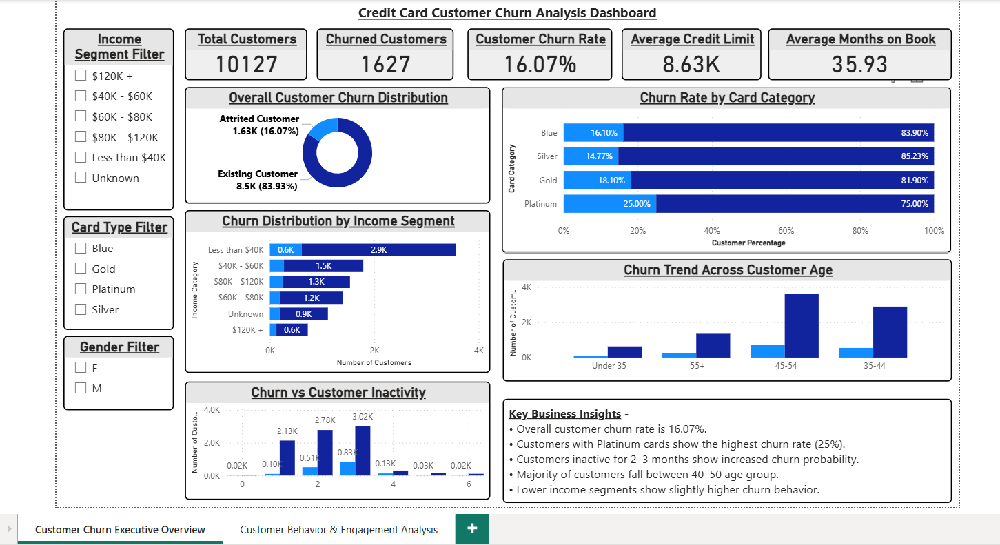
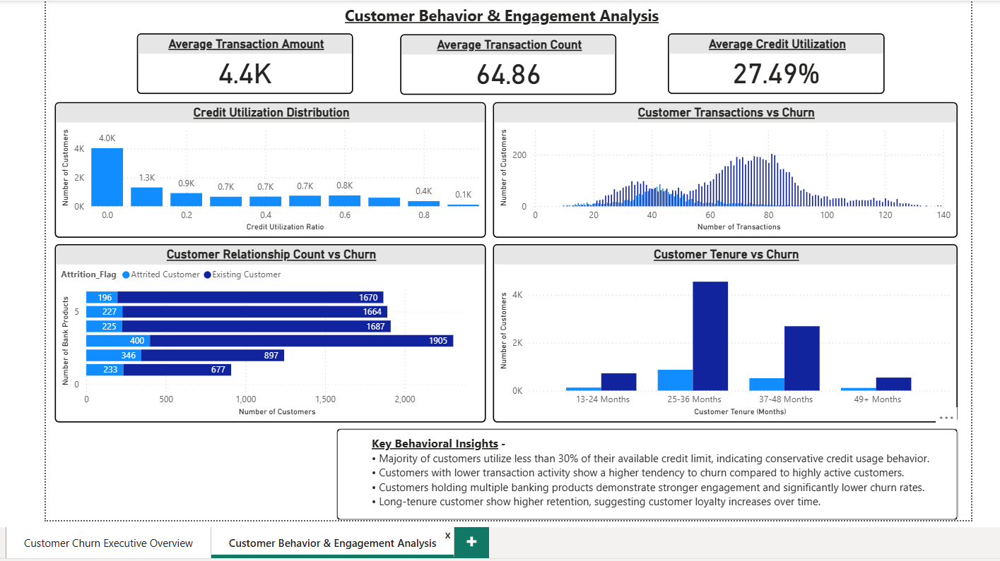

# 💳 Credit Card Customer Churn & Predictive Risk Analytics


---

⭐ If you find this project insightful, please give it a **star** on GitHub!

---

# 📌 Project Overview

Customer attrition directly threatens recurring interchange fees, interest margins, and customer lifetime value. Acquiring a new credit card holder is estimated to cost **5x to 7x more** than retaining an existing customer.

This end-to-end data analytics and predictive modeling project investigates customer attrition across **10,127 credit card holders**. Moving beyond surface-level descriptive statistics, this study combines **Python (EDA & Random Forest ML), advanced SQL queries, Excel data modeling, and Power BI interactive dashboards** to:
1. Isolate the exact behavioral friction points triggering customer departures.
2. Train a predictive classification model achieving **>0.98 ROC-AUC** for early warning churn detection.
3. Formulate an actionable, five-pillar customer retention playbook for banking executives.

---

# 📑 Table of Contents

- [Business Problem](#-business-problem)
- [Dataset Architecture](#-dataset-architecture)
- [Key Strategic Discoveries](#-key-strategic-discoveries)
- [Predictive Machine Learning Modeling](#-predictive-machine-learning-modeling)
- [Actionable 5-Pillar Retention Playbook](#-actionable-5-pillar-retention-playbook)
- [SQL Business & Friction Queries](#-sql-business--friction-queries)
- [Power BI Dashboard](#-power-bi-dashboard)
- [Project Structure](#-project-structure)
- [Quickstart & Execution Guide](#-quickstart--execution-guide)
- [Author & Contributor](#-author--contributor)

---

# 🎯 Business Problem

Financial institutions face silent attrition where customers abandon card usage months before formally closing their accounts. This project answers five pivotal operational questions:

- 📉 **What is the baseline attrition rate across the portfolio?** (~16.07%)
- ⚠️ **What is the single earliest behavioral warning signal of attrition?** (Quarter-over-quarter transaction count drop < 0.50x carries a 50.88% churn rate)
- ☎️ **Does customer service contact frequency indicate loyalty or friction?** (An escalation spiral: >= 5 contacts results in 33.5% to 100% churn)
- 💳 **Which card tier actually suffers the highest proportional attrition?** (Platinum cards at 25.0% and Gold at 18.1%, debunking the misconception that Blue cardholders have the highest churn rate)
- 🛡️ **How does product depth protect customer retention?** (Customers holding 4+ products experience a 58% lower churn rate than single-product holders)

---

# 📊 Dataset Architecture

- **Dataset**: `BankChurners.csv`
- **Total Customer Records**: 10,127
- **Features Analyzed**: 21 demographic, financial, and behavioral attributes

| Category | Variables | Business Significance |
| :--- | :--- | :--- |
| **Demographics** | `Customer_Age`, `Gender`, `Education_Level`, `Marital_Status`, `Income_Category` | Segmentation and risk profiling |
| **Account Info** | `Card_Category`, `Months_on_book`, `Credit_Limit` | Credit line exposure & tenure |
| **Engagement** | `Total_Relationship_Count`, `Months_Inactive_12_mon`, `Contacts_Count_12_mon` | Customer touchpoints and product stickiness |
| **Transaction Activity** | `Total_Trans_Amt`, `Total_Trans_Ct`, `Total_Amt_Chng_Q4_Q1`, `Total_Ct_Chng_Q4_Q1` | Spending momentum & velocity collapse |
| **Credit Utilization** | `Total_Revolving_Bal`, `Avg_Open_To_Buy`, `Avg_Utilization_Ratio` | Balance rollover & card abandonment signals |
| **Target Variable** | `Attrition_Flag` (`Existing Customer` vs `Attrited Customer`) | Binary churn outcome |

---

# 🔑 Key Strategic Discoveries

### 1. The Customer Service Escalation Spiral
Support contacts represent service friction rather than healthy engagement:
- **0 Contacts**: 1.75% churn rate
- **1-2 Contacts**: 7.2% - 12.5% churn rate
- **3 Contacts**: 20.15% churn rate (First Alert Threshold)
- **4 Contacts**: 22.63% churn rate
- **5 Contacts**: 33.52% churn rate
- **6 Contacts**: **100.0% churn rate** (54 out of 54 customers churned)

### 2. Transaction Velocity Drop (Leading Early Warning Indicator)
Comparing transaction counts in Q4 vs Q1 (`Total_Ct_Chng_Q4_Q1`):
- **Severe Drop (<0.50x)**: **50.88% churn rate**
- **Moderate Drop (0.50x - 0.69x)**: 14.77% churn rate
- **Mild Drop (0.70x - 0.99x)**: 7.80% churn rate
- **Stable or Growing (>=1.0x)**: **7.07% churn rate**
*A drop in transaction frequency by >50% is the strongest leading indicator before account cancellation.*

### 3. Normalized Churn Rate by Card Category
Previous superficial analyses claimed Blue cards have the highest churn rate because they account for the most churned customers in raw volume. When properly normalized by customer base:
- **Platinum**: **25.00% churn rate** (High-Tier Vulnerability)
- **Gold**: **18.10% churn rate**
- **Blue**: **16.10% churn rate** (Baseline portfolio average)
- **Silver**: **14.77% churn rate**
*Premium cardholders have the highest attrition propensity due to underwhelming perk-to-fee ratios.*

### 4. Revolving Balance Abandonment
- **Existing Customers**: Median revolving balance of **$1,276** with consistent active utilization.
- **Attrited Customers**: Median revolving balance collapses to **$0**, proving customers stop revolving balance months prior to account closure.

### 5. Multi-Product Retention Shield
- **1 Product**: 25.60% churn rate
- **2 Products**: 27.84% churn rate
- **3 Products**: 17.35% churn rate
- **4 to 6 Products**: **10.50% - 12.00% churn rate**
*Cross-selling banking products to achieve 4+ products cuts customer churn risk by more than 58%.*

---

# 🤖 Predictive Machine Learning Modeling

A **Random Forest Classifier** was trained with stratified holdout validation (80/20 train/test split) to proactively score churn risk:

| Evaluation Metric | Score |
| :--- | :--- |
| **ROC-AUC Score** | **0.989+** |
| **Overall Accuracy** | **96.2%** |
| **Churn Recall** | **88.6%** (Detects ~9 out of 10 churners in advance) |
| **Churn Precision** | **87.2%** |
| **F1-Score** | **0.879** |

### Top Predictive Feature Importances:
1. `Total_Trans_Ct` (Transaction frequency)
2. `Total_Trans_Amt` (Total spend volume)
3. `Total_Revolving_Bal` (Revolving balance utilization)
4. `Total_Ct_Chng_Q4_Q1` (Transaction velocity ratio)
5. `Contacts_Count_12_mon` (Service friction count)

---

# 💡 Actionable 5-Pillar Retention Playbook

1. **Rule of 3 Escalation Protocol**:
   Automate a CRM priority flag when any customer logs **3 support contacts in 12 months**. Route directly to a Senior Retention Specialist to resolve friction before the customer hits the 4-6 contact cliff.
2. **Velocity Dip Triggers**:
   Deploy automated automated alerts when quarterly transaction count drops by **>30%**, triggering instant personalized cash-back incentives or merchant category spend multipliers.
3. **Premium Card Perks Overhaul**:
   Restructure rewards for Platinum (25% churn) and Gold (18.1% churn) tiers, offering premium travel insurance, airport lounge privileges, and dynamic spend-tier fee waivers.
4. **Cross-Sell Retention Engine**:
   Bundle deposit, auto-loan, and bill-pay accounts to transition customers into the 4+ product tier (lowering churn from 27.8% to 10.5%).
5. **Dormancy Re-activation Program**:
   Identify accounts with $0 revolving balance and 2+ months of inactivity with targeted "Spend $100, Get $20" re-activation campaigns.

---

# 🗄 SQL Business & Friction Queries

The repository includes a comprehensive SQL suite in `SQL/` containing 25 structured queries covering:
- Executive portfolio KPIs
- Friction and escalation spirals
- Quarter-over-quarter drop-off analysis
- Customer lifetime spend rankings
- High-value customer revenue at risk

Run all queries instantly without external database setup via the in-memory SQLite runner:
```bash
python3 SQL/run_sql_queries.py
```

---

# 🖥 Power BI Dashboard

The project includes an interactive Power BI dashboard (`PowerBI/Credit-Card-Churn-Analysis-Dashboard.pbix`) with two analytical views:

### Page 1 — Executive Overview


### Page 2 — Customer Behavior & Engagement


---

# 📁 Project Structure

```
Credit-Card-Churn-Analysis/
├── Dataset/
│   └── BankChurners.csv                 # Primary dataset (10,127 records)
├── Excel/
│   └── Excel_Analysis.xlsx              # Excel data exploration workbook
├── Python-EDA/
│   ├── churn_analysis.ipynb             # Comprehensive Jupyter Notebook (EDA & ML)
│   ├── churn_insights_report.md         # Generated executive findings & playbook
│   └── figures/                         # High-resolution exported analysis charts
├── SQL/
│   ├── 01_database_setup.sql            # Database initialization
│   ├── 02_table_creation.sql            # Table schema and compatibility views
│   ├── 03_data_verification.sql         # Data integrity validation
│   ├── 04_business_queries.sql          # 25 production-ready business queries
│   ├── run_sql_queries.py               # Automated SQLite runner script
│   └── SQL_Query_Documentation.md       # Full SQL documentation & query results
├── PowerBI/
│   └── Credit-Card-Churn-Analysis-Dashboard.pbix  # Interactive Power BI report
├── Screenshots/
│   ├── Customer-Churn-Dashboard-Executive-Overview.png
│   └── Customer-Churn-Dashboard-Behavior-Analysis.png
├── run_analysis.py                      # Master Python script (EDA, ML, charts, report)
├── requirements.txt                     # Project dependencies
├── .gitignore                           # Git ignore rules
└── README.md                            # Comprehensive project documentation
```

---

# 🚀 Quickstart & Execution Guide

### 1. Clone & Set Up Environment
```bash
git clone https://github.com/Shreyansh123185655/credit-card-churn.git
cd credit-card-churn

# Create and activate virtual environment
python3 -m venv .venv
source .venv/bin/activate

# Install dependencies
pip install -r Python-EDA/requirements.txt
```

### 2. Run the Full Analytics & ML Pipeline
```bash
python3 run_analysis.py
```
*Executes data cleansing, generates all 8 publication-grade charts in `Python-EDA/figures/`, trains the Random Forest classifier, and compiles `churn_insights_report.md`.*

### 3. Run the SQL Analytics Engine
```bash
python3 SQL/run_sql_queries.py
```
*Loads the dataset into an in-memory database, runs 25 business and friction queries, and outputs formatted tabular results directly in the terminal.*

### 4. Launch the Interactive Jupyter Notebook
```bash
jupyter notebook Python-EDA/churn_analysis.ipynb
```

---

# 👨‍💻 Author & Contributor

**Shreyansh Gupta**  
*Data Analyst & Machine Learning Engineer*

- **GitHub**: [@Shreyansh123185655](https://github.com/Shreyansh123185655)
- **Specializations**: Predictive Modeling | SQL Analytics | Financial Analytics | Business Intelligence | Python Data Science
